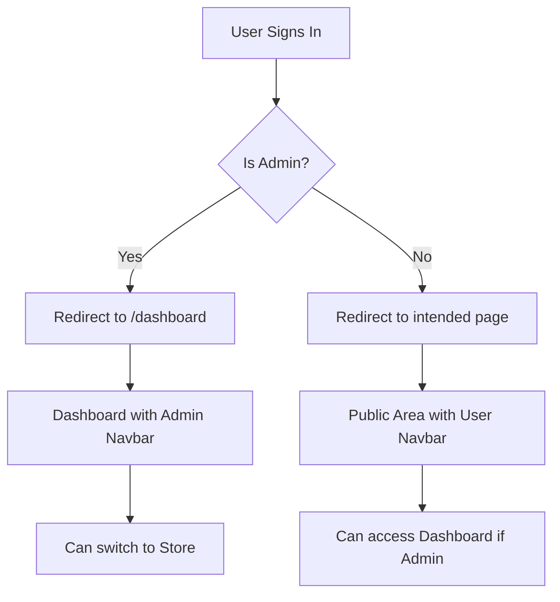

# Admin Functionality Implementation

This document explains the admin functionality implemented in the ArchCool e-commerce application using Better Auth.

## 🔐 Admin Features Implemented

### 1. **Admin Role Management**

- Users have a `role` field in the database (default: "customer", admin: "admin")
- Admin plugin configured in Better Auth for comprehensive admin functionality
- Admin role checks implemented throughout the application

### 2. **Smart Navigation & Routing**

- **Admin Detection**: Automatic admin role detection on sign-in
- **Conditional Redirects**: Admins are redirected to `/dashboard` after sign-in
- **Contextual Navigation**: Different navbar behavior in admin vs public areas
- **Dashboard Access**: Admin-only "Dashboard" button in user dropdown

### 3. **Enhanced User Interface**

- **Dynamic Navbar**: Shows different content based on admin status and current route
- **Admin Badge**: Dashboard shows "Admin Dashboard" branding
- **Quick Access**: "Back to Store" link when in dashboard area
- **Seamless Switching**: Easy navigation between admin and public areas

## 🚀 Usage Instructions

### Creating an Admin User

1. **Manual Process** (Recommended for first admin):

   ```bash
   # 1. Sign up normally at http://localhost:3000/sign-up
   # Use: admin@archcool.com / AdminPassword123!

   # 2. Update role in database
   npm run make-admin admin@archcool.com
   ```

2. **SQL Direct** (Alternative):
   ```sql
   UPDATE "User"
   SET role = 'admin'
   WHERE email = 'admin@archcool.com';
   ```

### Admin Login Flow

1. **Sign In**: Go to `/sign-in` with admin credentials
2. **Auto-Redirect**: Automatically redirected to `/dashboard`
3. **Admin Access**: Full access to dashboard features
4. **Store Navigation**: Can easily return to public store

### Navigation Features

#### **Public Area (Admin Logged In)**

- Shows "Dashboard" button in navbar
- User dropdown includes "Dashboard" option
- Cart functionality remains available

#### **Dashboard Area (Admin)**

- Navbar shows "Admin Dashboard" branding
- "Back to Store" link in navigation
- No cart button (admin context)
- User dropdown includes "Back to Store" option

## 🛠️ Technical Implementation

### Components Modified

1. **`useAdminCheck` Hook** (`/app/hooks/useAdminCheck.ts`)
   - Detects admin role from session
   - Provides consistent admin state across components

2. **`ClientNavbar` Component** (`/app/components/storefront/ClientNavbar.tsx`)
   - Context-aware navigation
   - Shows different content for admin/dashboard areas
   - Handles admin-specific buttons and links

3. **`UserDropdown` Component** (`/app/components/storefront/UserDropdown.tsx`)
   - Admin-specific menu items
   - Dashboard/Store switching options
   - Context-aware menu structure

4. **Sign-in Page** (`/app/(auth)/sign-in/page.tsx`)
   - Admin role detection after login
   - Automatic dashboard redirect for admins
   - Fallback to normal redirect for non-admins

5. **Dashboard Layout** (`/app/dashboard/layout.tsx`)
   - Integrated with unified navbar system
   - Maintains admin protection
   - Consistent branding across admin areas

### Authentication Flow



## 🔒 Security Features

- **Route Protection**: Dashboard routes protected by admin role check
- **Session Validation**: Consistent session checking across components
- **Role Verification**: Server-side role validation in dashboard layout
- **Access Control**: Admin-only features properly gated

## 📝 Admin Capabilities

With the Better Auth admin plugin, admins can:

- Manage users (create, update, ban, unban)
- View and manage user sessions
- Access comprehensive dashboard
- Switch between admin and customer contexts
- Maintain full store functionality when needed

## 🎯 User Experience

### **For Admins**:

- Seamless sign-in experience with automatic dashboard redirect
- Easy navigation between admin and customer views
- Contextual interface that adapts to current role/area
- Quick access to both admin tools and store functionality

### **For Regular Users**:

- No changes to existing user experience
- Clean interface without admin-specific elements
- Standard navigation and functionality maintained

## 🚀 Next Steps

1. **Test Admin Flow**: Create admin user and test all navigation features
2. **Enhance Dashboard**: Add more admin-specific functionality as needed
3. **Role Management**: Implement user role management interface for admins
4. **Permissions**: Add granular permissions for different admin levels

---

_This implementation provides a robust foundation for admin functionality while maintaining a seamless user experience for both administrators and regular customers._
